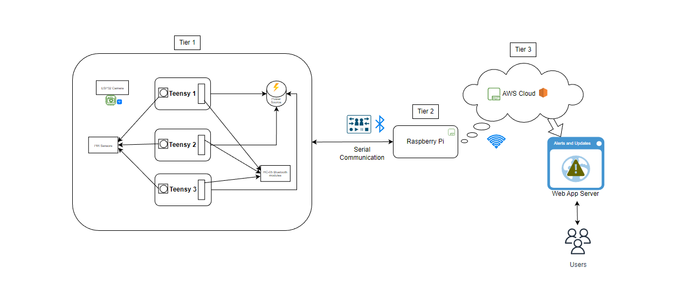
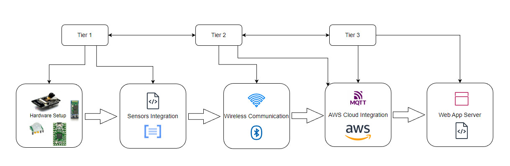

## Low Cost Efficient Intrusion Detection System

### Outline

- [About](#about)
- [Features](#features)
- [Required Hardware](#required-hardware)
- [Project Code and Directory Structure](#project-code-and-directory-structure)
- [Basic Architecture](#basic-architecture)
- [Project Setup Sequence](#project-setup-sequence)
- [Future Considerations for Performance Improvements](#future-considerations-for-performance-improvements)

### About

This project is a very basic Proof of Concept for an efficient Intrusion Detection System using Teensy, PIR Sensor, ESP32 sensor modules along with Raspberry Pi for Edge tier logic. The web server is deployed on amazon aws for this project but can be deployed with other cloud vendors as well.

### Features

- Live camera stream feeding to cloud server using Websockets and MQTT
- Detects Motion and communicates the data over to Cloud via MQTT 
- The feed can be viewed live on the website deployed on Cloud server
- The PIR sensors consume commands for the following actions:
    - **<module_name>:PIR_START**           - Starts the PIR sensor detection
    - **<module_name>:PIR_STOP**            - Stops the PIR sensor detection
    - **<module_name>:PIR_TIMEOUT n**       - Sets the timemout of the PIR sensor to **n** seconds
    - **<module_name>:PIR_VERBOSE v**       - Sets the verbosity of Serial data of the PIR sensor to **v**. The **value of v should be integer** and if it is 0 or less, it disables the logs. Any value greater than 0 enables it.

For more details on each module, refer to the [Basic Architecture](#basic-architecture) section.

### Required Hardware

- ESP32 CAMERA
- PIR Sensors (HC-SR501)
- Teensy 2.0
- HC05 Bluetooth modules
- Raspberry Pi

### Project Code and Directory structure

```
────Cloud_Tier_3
│   ├───data_store_ops
│   │   ├───cloud_library
│   │   └───db
│   └───web
│       └───server
├───Edge_Tier_2
│   ├───ctx_serial
│   ├───edge_library
│   └───ESP32_Websockets
└───Sensor-Tier-1
    ├───AT_BT_SETUP
    ├───ESP32_CAMERA
    └───PIR_SENSING
```

The code is **categorized according to the respective tiers** in different directories.
- [Sensor-Tier-1](./Sensor-Tier-1/README.md) - Contains code for PIR sensors and ESP32 Camera modules. 
- [Edge_Tier_2](./Edge_Tier_2/README.md) - Contains code for Websockets Server and MQTT Logic in Raspberry PI 
- [Cloud_Tier_3](./Cloud_Tier_3/README.md) - Contains code for the MQTT data upload to MongoDB program and WebApp logic.

### Basic Architecture



### Project Setup Sequence

Follow the below diagram for setup. The setup should be done according to the tiers as per the diagram for best results. Although setting up the different tiers in any order should work, but may produce unexpected errors or need restarting the modules. The below order is perfect and should work without errors.



### Future Considerations for Performance Improvements

Following are the improvements/changes that will be made to this project for better outputs and performance,

- **Hardware Improvement Considerations**

    - **PIR Sensors**

    - **ESP32**

        1. Sending individual stream buffers over Websockets and MQTT is expensive in the current architecture. ESP32 Camera module is capable of sending the frame buffer bytes directly over MQTT or Websocket to Cloud Server. The extra step of having to send the buffer over to Raspberry Pi and from there forwarding it to the Cloud Server generates a **considerable "gap"**.
        
        2. The module flash memory can be used for storing the values like WiFi SSID and PASSWORD instead of having to hard code the values. This way, it would allow any user to dynamically change the WiFi PASSWORD or SSID or both if needed.
        
        3. Since ESP32 is also capable of creating a WiFi hotspot and server custom web UI on a local server, both of them can be implemented for the ESP32 module. So, the first time the user starts the ESP32 cam, Hotspot is created with default credentials wherein the user must sign in and then add WiFi SSID and PASSWORD that will be used for establishing connection as a client. Once the client is activated, the stream then can be communicated securely(using TLS/SSL) to the Cloud Server.  

- **Software Improvement Considerations**

    - **Raspberry Pi**
        - Remove the requirement for using RPi as a gateway for Video Streaming. This would improve the streaming quality as well as make the stream real-time instead of near-real-time.

    - **MongoDB Data Storage**
        - Instead of a simple script, create a stream pipeline using RabbitMQ or maybe Kafka. this is to ensure that no events are lost during the transmission as currently the path for ESP32 frame Images is longer and some frames are missed from getting stored due to them being dropped.

    - **Web Server**
        - Options can be added for being able to customize the sensor behaviour remotely using the web app client.
